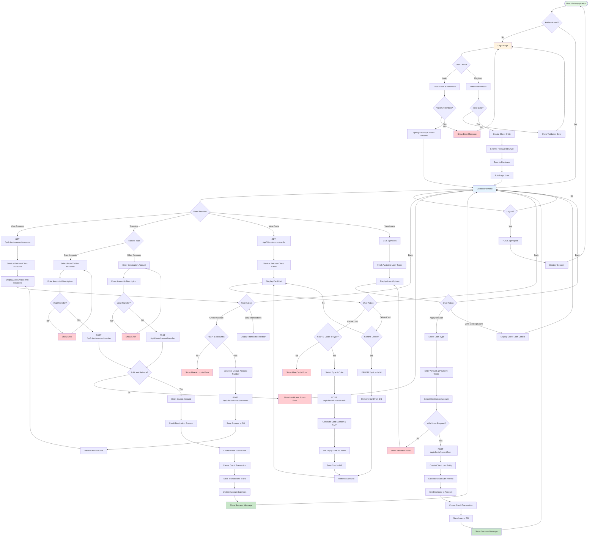

# 🏦 Home Banking Application

A full-stack home banking application built with **Vue.js 3** and **Spring Boot**, demonstrating modern web development practices with a complete banking system simulation.


## 🌟 Live Demo

🚀 **[View Live Application on Heroku](https://stark-escarpment-65840.herokuapp.com/)**

---

## 📋 Table of Contents

- [About the Project](#about-the-project)
- [Features](#features)
- [Technology Stack](#technology-stack)
- [Architecture](#architecture)
- [Getting Started](#getting-started)
  - [Prerequisites](#prerequisites)
  - [Installation](#installation)
  - [Running the Application](#running-the-application)
- [Code Examples](#code-examples)
- [Project Structure](#project-structure)
- [API Documentation](#api-documentation)
- [Security](#security)
- [Testing](#testing)
- [Deployment](#deployment)
- [Contributing](#contributing)
- [License](#license)

---

## 🎯 About the Project

This home banking application is a comprehensive full-stack project developed as the final project for a 700-hour Agile & Scrum bootcamp. It simulates a real-world banking system where users can:

- Manage multiple bank accounts
- Create and manage credit/debit cards
- Perform transactions between accounts
- Apply for loans
- View transaction history
- Secure authentication and authorization

The application follows modern development practices including RESTful API design, component-based frontend architecture, and secure authentication.

---

## ✨ Features

### 👤 User Management
- ✅ User registration and authentication
- ✅ Secure login with Spring Security
- ✅ Password encryption
- ✅ User profile management

### 💳 Account Management
- ✅ Create multiple bank accounts
- ✅ View account balances
- ✅ Account transaction history
- ✅ Different account types

### 💰 Transactions
- ✅ Transfer money between own accounts
- ✅ Transfer to other users' accounts
- ✅ Real-time balance updates
- ✅ Transaction validation and security

### 🏦 Card Services
- ✅ Create debit/credit cards
- ✅ Multiple card types (Gold, Silver, etc.)
- ✅ Card activation/deactivation
- ✅ CVV and expiration date management

### 📊 Loan Management
- ✅ Apply for loans
- ✅ View loan status
- ✅ Automatic loan approval workflow
- ✅ Loan payment tracking

---

## 🛠️ Technology Stack

### Frontend
- **Vue.js 3** - Progressive JavaScript framework
- **Vuex** - State management
- **Vue Router** - Client-side routing
- **Axios** - HTTP client for API calls
- **Bootstrap 5** - CSS framework
- **SASS/SCSS** - CSS preprocessor
- **Pug** - Template engine
- **Font Awesome** - Icon library
- **SweetAlert** - Beautiful alert modals
- **Animate.css** - Animation library

### Backend
- **Spring Boot 2.5.3** - Java framework
- **Spring Security** - Authentication and authorization
- **Spring Data JPA** - Database persistence
- **H2 Database** - In-memory database (development)
- **Maven** - Dependency management
- **Hibernate** - ORM framework

### DevOps & Tools
- **Docker** - Containerization
- **Heroku** - Cloud deployment
- **JaCoCo** - Code coverage
- **JUnit** - Testing framework
- **Git** - Version control

---

## 🏗️ Architecture

```
┌─────────────────────────────────────────────────────────┐
│                     Frontend (Vue.js)                    │
│  ┌──────────┐  ┌──────────┐  ┌──────────┐  ┌─────────┐ │
│  │  Views   │  │Components│  │  Router  │  │  Vuex   │ │
│  └──────────┘  └──────────┘  └──────────┘  └─────────┘ │
└─────────────────────────────────────────────────────────┘
                          │
                    HTTP/REST API
                          │
┌─────────────────────────────────────────────────────────┐
│                  Backend (Spring Boot)                   │
│  ┌──────────┐  ┌──────────┐  ┌──────────┐  ┌─────────┐ │
│  │Controller│  │ Service  │  │Repository│  │ Models  │ │
│  └──────────┘  └──────────┘  └──────────┘  └─────────┘ │
│                          │                               │
│                  Spring Security                         │
└─────────────────────────────────────────────────────────┘
                          │
                      Database
                    (H2/PostgreSQL)
```

---

## 📊 Application Flow Diagram

<!-- Generated by Coding Agent -->
The following Mermaid diagram illustrates the complete application logic flow, including user authentication, account management, transactions, cards, and loans:



### Flow Diagram Legend

- 🟢 **Green nodes**: Entry points and success states
- 🔵 **Blue nodes**: Main application states
- 🟠 **Orange nodes**: Input/form pages
- 🔴 **Red nodes**: Error states
- ◇ **Diamond shapes**: Decision points
- ▭ **Rectangle shapes**: Processes/Actions
- ⬭ **Rounded rectangles**: Start/End states

---

## 🚀 Getting Started

### Prerequisites

Before you begin, ensure you have the following installed:

#### All Platforms
- **Java JDK 11+** - [Download](https://adoptopenjdk.net/)
- **Node.js 14+** - [Download](https://nodejs.org/)
- **npm 6+** or **yarn**
- **Maven 3.6+**
- **Git**

#### Installation Commands

**macOS:**
```bash
brew install node
brew install maven
brew install openjdk@11
npm install -g @vue/cli
```

**Linux (Ubuntu/Debian):**
```bash
sudo apt update
sudo apt install nodejs npm
sudo apt install maven
sudo apt install openjdk-11-jdk
npm install -g @vue/cli
```

**Windows:**
```bash
choco install nodejs
choco install maven
choco install openjdk11
npm install -g @vue/cli
```

---

### Installation

1. **Clone the repository:**
```bash
git clone https://github.com/hoodini/Home-Banking-Vue-Java-SpringBoot.git
cd Home-Banking-Vue-Java-SpringBoot
```

2. **Install frontend dependencies:**
```bash
cd frontend
npm install
```

3. **Install backend dependencies:**
```bash
cd ../backend
mvn clean install
```

---

### Running the Application

#### Option 1: Development Mode (Separate Frontend & Backend)

**Terminal 1 - Start Backend Server:**
```bash
cd backend
mvn spring-boot:run
```
Backend will run on `http://localhost:8080`

**Terminal 2 - Start Frontend Dev Server:**
```bash
cd frontend
npm run serve
```
Frontend will run on `http://localhost:8081`

#### Option 2: Production Mode (Single Build)

```bash
# Build frontend
cd frontend
npm run build

# Build and run complete application
cd ..
mvn clean install
cd backend
mvn spring-boot:run
```

Access the application at `http://localhost:8080`

---

## 💻 Code Examples

### 1. Frontend - User Authentication (Vue.js)

**Login Component:**
```javascript
// frontend/src/views/Login.vue
export default {
  data() {
    return {
      email: '',
      password: '',
      isLoading: false
    }
  },
  methods: {
    async login() {
      this.isLoading = true;
      try {
        // Send login request to backend
        const response = await axios.post('/api/login', {
          username: this.email,
          password: this.password
        }, {
          headers: { 'Content-Type': 'application/x-www-form-urlencoded' }
        });
        
        if (response.status === 200) {
          // Store user data in Vuex
          this.$store.commit('setUser', response.data);
          
          // Navigate to dashboard
          this.$router.push('/menu');
          
          // Show success message
          swal("Success!", "Welcome back!", "success");
        }
      } catch (error) {
        swal("Error", "Invalid credentials", "error");
      } finally {
        this.isLoading = false;
      }
    }
  }
}
```

### 2. Frontend - Account Transfer (Vuex Store)

**Store Actions:**
```javascript
// frontend/src/store/index.js
export default createStore({
  state: {
    accounts: [],
    currentUser: null,
    transactions: []
  },
  
  mutations: {
    SET_ACCOUNTS(state, accounts) {
      state.accounts = accounts;
    },
    
    ADD_TRANSACTION(state, transaction) {
      state.transactions.push(transaction);
    }
  },
  
  actions: {
    async transferMoney({ commit, state }, transferData) {
      try {
        const response = await axios.post('/api/transactions', {
          amount: transferData.amount,
          description: transferData.description,
          accountFrom: transferData.fromAccount,
          accountTo: transferData.toAccount
        });
        
        // Update local state
        commit('ADD_TRANSACTION', response.data);
        
        // Refresh account balances
        await this.dispatch('fetchAccounts');
        
        return { success: true };
      } catch (error) {
        return { 
          success: false, 
          error: error.response.data.message 
        };
      }
    },
    
    async fetchAccounts({ commit }) {
      const response = await axios.get('/api/clients/current/accounts');
      commit('SET_ACCOUNTS', response.data);
    }
  }
});
```

### 3. Frontend - Account Component

**Displaying Accounts:**
```vue
<!-- frontend/src/components/Accounts.vue -->
<template>
  <div class="accounts-container">
    <h2>My Accounts</h2>
    <div class="account-list">
      <div 
        v-for="account in accounts" 
        :key="account.id" 
        class="account-card"
      >
        <div class="account-number">{{ account.number }}</div>
        <div class="account-balance">
          ${{ formatCurrency(account.balance) }}
        </div>
        <div class="account-date">
          Created: {{ formatDate(account.creationDate) }}
        </div>
      </div>
    </div>
    
    <button @click="createNewAccount" class="btn-create">
      + Create New Account
    </button>
  </div>
</template>

<script>
export default {
  computed: {
    accounts() {
      return this.$store.state.accounts;
    }
  },
  
  methods: {
    formatCurrency(amount) {
      return new Intl.NumberFormat('en-US', {
        minimumFractionDigits: 2
      }).format(amount);
    },
    
    formatDate(date) {
      return new Date(date).toLocaleDateString('en-US');
    },
    
    async createNewAccount() {
      try {
        const response = await axios.post('/api/clients/current/accounts');
        
        if (response.status === 201) {
          await this.$store.dispatch('fetchAccounts');
          swal("Success!", "New account created!", "success");
        }
      } catch (error) {
        swal("Error", error.response.data, "error");
      }
    }
  },
  
  mounted() {
    this.$store.dispatch('fetchAccounts');
  }
}
</script>
```

### 4. Backend - Account Controller (Spring Boot)

**REST API Endpoints:**
```java
// backend/src/main/java/springbootvuejs/controller/AccountController.java
@RestController
@RequestMapping("/api")
public class AccountController {
    
    @Autowired
    private ServiceAccounts serviceAccounts;
    
    @Autowired
    private ServiceClients serviceClients;
    
    /**
     * Get all accounts for current authenticated user
     */
    @GetMapping("/clients/current/accounts")
    public ResponseEntity<List<AccountDTO>> getCurrentClientAccounts(
            Authentication authentication) {
        
        String email = authentication.getName();
        Client client = serviceClients.findByEmail(email);
        
        List<AccountDTO> accounts = client.getAccounts()
            .stream()
            .map(AccountDTO::new)
            .collect(Collectors.toList());
            
        return ResponseEntity.ok(accounts);
    }
    
    /**
     * Create a new account for current user
     */
    @PostMapping("/clients/current/accounts")
    public ResponseEntity<String> createAccount(
            Authentication authentication) {
        
        String email = authentication.getName();
        Client client = serviceClients.findByEmail(email);
        
        // Validate: maximum 3 accounts per client
        if (client.getAccounts().size() >= 3) {
            return ResponseEntity
                .status(HttpStatus.FORBIDDEN)
                .body("Maximum number of accounts reached");
        }
        
        // Generate unique account number
        String accountNumber = generateAccountNumber();
        
        // Create new account
        Account newAccount = new Account(accountNumber, LocalDateTime.now(), 0.0);
        newAccount.setClient(client);
        
        serviceAccounts.save(newAccount);
        
        return ResponseEntity
            .status(HttpStatus.CREATED)
            .body("Account created successfully");
    }
    
    /**
     * Generate unique account number
     */
    private String generateAccountNumber() {
        String number;
        do {
            number = "VIN" + String.format("%08d", 
                (int)(Math.random() * 100000000));
        } while (serviceAccounts.existsByNumber(number));
        
        return number;
    }
}
```

### 5. Backend - Transaction Service

**Business Logic Layer:**
```java
// backend/src/main/java/springbootvuejs/services/imp/ServiceOperationsImpl.java
@Service
public class ServiceOperationsImpl implements ServiceOperations {
    
    @Autowired
    private AccountRepository accountRepository;
    
    @Autowired
    private TransactionRepository transactionRepository;
    
    /**
     * Transfer money between accounts
     * @param fromAccountNumber Source account
     * @param toAccountNumber Destination account
     * @param amount Transfer amount
     * @param description Transaction description
     */
    @Transactional
    public TransferResult transferMoney(
            String fromAccountNumber,
            String toAccountNumber, 
            Double amount,
            String description) {
        
        // Validate inputs
        if (amount == null || amount <= 0) {
            return TransferResult.error("Invalid amount");
        }
        
        if (fromAccountNumber.equals(toAccountNumber)) {
            return TransferResult.error("Cannot transfer to same account");
        }
        
        // Find accounts
        Account fromAccount = accountRepository.findByNumber(fromAccountNumber);
        Account toAccount = accountRepository.findByNumber(toAccountNumber);
        
        if (fromAccount == null || toAccount == null) {
            return TransferResult.error("Account not found");
        }
        
        // Check sufficient balance
        if (fromAccount.getBalance() < amount) {
            return TransferResult.error("Insufficient funds");
        }
        
        // Perform transfer
        fromAccount.setBalance(fromAccount.getBalance() - amount);
        toAccount.setBalance(toAccount.getBalance() + amount);
        
        // Create transactions
        Transaction debit = new Transaction(
            TransactionType.DEBIT,
            -amount,
            description,
            LocalDateTime.now(),
            fromAccount.getBalance()
        );
        debit.setAccount(fromAccount);
        
        Transaction credit = new Transaction(
            TransactionType.CREDIT,
            amount,
            description,
            LocalDateTime.now(),
            toAccount.getBalance()
        );
        credit.setAccount(toAccount);
        
        // Save changes
        accountRepository.save(fromAccount);
        accountRepository.save(toAccount);
        transactionRepository.save(debit);
        transactionRepository.save(credit);
        
        return TransferResult.success("Transfer completed successfully");
    }
}
```

### 6. Backend - Security Configuration

**Spring Security Setup:**
```java
// backend/src/main/java/springbootvuejs/configuration/WebSecurityConfiguration.java
@Configuration
@EnableWebSecurity
public class WebSecurityConfiguration extends WebSecurityConfigurerAdapter {
    
    @Autowired
    private UserDetailsService userDetailsService;
    
    @Bean
    public PasswordEncoder passwordEncoder() {
        return new BCryptPasswordEncoder();
    }
    
    @Override
    protected void configure(HttpSecurity http) throws Exception {
        http
            .authorizeRequests()
                // Public endpoints
                .antMatchers("/api/register", "/web/**", "/h2-console/**")
                    .permitAll()
                // Protected endpoints - require authentication
                .antMatchers("/api/**")
                    .authenticated()
            .and()
                .formLogin()
                    .loginPage("/api/login")
                    .usernameParameter("email")
                    .passwordParameter("password")
                    .successHandler(this::onAuthenticationSuccess)
                    .failureHandler(this::onAuthenticationFailure)
            .and()
                .logout()
                    .logoutUrl("/api/logout")
                    .logoutSuccessHandler(this::onLogoutSuccess)
            .and()
                .csrf()
                    .disable()
                .headers()
                    .frameOptions()
                    .disable();
    }
    
    private void onAuthenticationSuccess(
            HttpServletRequest request,
            HttpServletResponse response,
            Authentication authentication) throws IOException {
        
        response.setStatus(HttpStatus.OK.value());
        response.getWriter().write("Login successful");
    }
    
    private void onAuthenticationFailure(
            HttpServletRequest request,
            HttpServletResponse response,
            AuthenticationException exception) throws IOException {
        
        response.setStatus(HttpStatus.UNAUTHORIZED.value());
        response.getWriter().write("Invalid credentials");
    }
}
```

### 7. Backend - Domain Model

**Entity Classes:**
```java
// backend/src/main/java/springbootvuejs/models/Account.java
@Entity
public class Account {
    
    @Id
    @GeneratedValue(strategy = GenerationType.IDENTITY)
    private Long id;
    
    private String number;
    private LocalDateTime creationDate;
    private Double balance;
    
    @ManyToOne(fetch = FetchType.EAGER)
    @JoinColumn(name = "client_id")
    private Client client;
    
    @OneToMany(mappedBy = "account", fetch = FetchType.EAGER)
    private Set<Transaction> transactions = new HashSet<>();
    
    // Constructors
    public Account() {}
    
    public Account(String number, LocalDateTime creationDate, Double balance) {
        this.number = number;
        this.creationDate = creationDate;
        this.balance = balance;
    }
    
    // Getters and Setters
    public Long getId() { return id; }
    public String getNumber() { return number; }
    public void setNumber(String number) { this.number = number; }
    
    public Double getBalance() { return balance; }
    public void setBalance(Double balance) { this.balance = balance; }
    
    public LocalDateTime getCreationDate() { return creationDate; }
    public void setCreationDate(LocalDateTime date) { this.creationDate = date; }
    
    public Client getClient() { return client; }
    public void setClient(Client client) { this.client = client; }
    
    public Set<Transaction> getTransactions() { return transactions; }
}
```

```java
// backend/src/main/java/springbootvuejs/models/Client.java
@Entity
public class Client {
    
    @Id
    @GeneratedValue(strategy = GenerationType.IDENTITY)
    private Long id;
    
    private String firstName;
    private String lastName;
    private String email;
    private String password;
    
    @OneToMany(mappedBy = "client", fetch = FetchType.EAGER)
    private Set<Account> accounts = new HashSet<>();
    
    @OneToMany(mappedBy = "client", fetch = FetchType.EAGER)
    private Set<ClientLoan> clientLoans = new HashSet<>();
    
    @OneToMany(mappedBy = "client", fetch = FetchType.EAGER)
    private Set<Card> cards = new HashSet<>();
    
    // Constructors
    public Client() {}
    
    public Client(String firstName, String lastName, String email, String password) {
        this.firstName = firstName;
        this.lastName = lastName;
        this.email = email;
        this.password = password;
    }
    
    // Business methods
    public void addAccount(Account account) {
        account.setClient(this);
        accounts.add(account);
    }
    
    public void addCard(Card card) {
        card.setClient(this);
        cards.add(card);
    }
    
    // Getters and Setters
    // ... (standard getters/setters)
}
```

### 8. Backend - Data Transfer Objects (DTOs)

**DTOs for API Responses:**
```java
// backend/src/main/java/springbootvuejs/dtos/AccountDTO.java
public class AccountDTO {
    
    private Long id;
    private String number;
    private LocalDateTime creationDate;
    private Double balance;
    private Set<TransactionDTO> transactions;
    
    public AccountDTO(Account account) {
        this.id = account.getId();
        this.number = account.getNumber();
        this.creationDate = account.getCreationDate();
        this.balance = account.getBalance();
        this.transactions = account.getTransactions()
            .stream()
            .map(TransactionDTO::new)
            .collect(Collectors.toSet());
    }
    
    // Getters
    public Long getId() { return id; }
    public String getNumber() { return number; }
    public LocalDateTime getCreationDate() { return creationDate; }
    public Double getBalance() { return balance; }
    public Set<TransactionDTO> getTransactions() { return transactions; }
}
```

### 9. Frontend - API Service Layer

**Centralized API Calls:**
```javascript
// frontend/src/services/api.js
import axios from 'axios';

const API_URL = process.env.VUE_APP_API_URL || '/api';

// Create axios instance with default config
const apiClient = axios.create({
  baseURL: API_URL,
  withCredentials: true,
  headers: {
    'Content-Type': 'application/json'
  }
});

// API service object
export default {
  // Authentication
  login(credentials) {
    const params = new URLSearchParams();
    params.append('email', credentials.email);
    params.append('password', credentials.password);
    
    return apiClient.post('/login', params, {
      headers: { 'Content-Type': 'application/x-www-form-urlencoded' }
    });
  },
  
  register(userData) {
    return apiClient.post('/clients', userData);
  },
  
  logout() {
    return apiClient.post('/logout');
  },
  
  // Accounts
  getAccounts() {
    return apiClient.get('/clients/current/accounts');
  },
  
  createAccount() {
    return apiClient.post('/clients/current/accounts');
  },
  
  // Transactions
  createTransaction(transactionData) {
    return apiClient.post('/transactions', transactionData);
  },
  
  // Cards
  getCards() {
    return apiClient.get('/clients/current/cards');
  },
  
  createCard(cardData) {
    return apiClient.post('/clients/current/cards', cardData);
  },
  
  // Loans
  getLoans() {
    return apiClient.get('/loans');
  },
  
  applyForLoan(loanData) {
    return apiClient.post('/loans', loanData);
  },
  
  // Client
  getCurrentClient() {
    return apiClient.get('/clients/current');
  }
};
```

### 10. Frontend - Router Configuration

**Vue Router Setup:**
```javascript
// frontend/src/router/index.js
import { createRouter, createWebHistory } from 'vue-router';
import Login from '../views/Login.vue';
import Menu from '../views/Menu.vue';
import store from '../store';

const routes = [
  {
    path: '/',
    redirect: '/login'
  },
  {
    path: '/login',
    name: 'Login',
    component: Login,
    meta: { 
      requiresAuth: false,
      title: 'Login - Home Banking'
    }
  },
  {
    path: '/menu',
    name: 'Menu',
    component: Menu,
    meta: { 
      requiresAuth: true,
      title: 'Dashboard - Home Banking'
    }
  }
];

const router = createRouter({
  history: createWebHistory(process.env.BASE_URL),
  routes
});

// Navigation guard
router.beforeEach((to, from, next) => {
  // Update page title
  document.title = to.meta.title || 'Home Banking';
  
  // Check authentication
  const isAuthenticated = store.state.currentUser !== null;
  
  if (to.meta.requiresAuth && !isAuthenticated) {
    // Redirect to login if not authenticated
    next('/login');
  } else if (to.path === '/login' && isAuthenticated) {
    // Redirect to menu if already authenticated
    next('/menu');
  } else {
    next();
  }
});

export default router;
```

---

## 📁 Project Structure

```
Home-Banking-Vue-Java-SpringBoot/
│
├── backend/                          # Spring Boot backend
│   ├── src/
│   │   ├── main/
│   │   │   ├── java/
│   │   │   │   └── springbootvuejs/
│   │   │   │       ├── SpringBootVuejsApplication.java
│   │   │   │       ├── configuration/    # Security & config
│   │   │   │       │   ├── WebSecurityConfiguration.java
│   │   │   │       │   ├── WebAuthentication.java
│   │   │   │       │   └── SpaRedirectFilterConfiguration.java
│   │   │   │       ├── controller/       # REST Controllers
│   │   │   │       │   ├── AccountController.java
│   │   │   │       │   ├── CardsController.java
│   │   │   │       │   ├── ClientController.java
│   │   │   │       │   ├── OperationsController.java
│   │   │   │       │   └── BackendController.java
│   │   │   │       ├── models/           # Entity classes
│   │   │   │       │   ├── Account.java
│   │   │   │       │   ├── Card.java
│   │   │   │       │   ├── Client.java
│   │   │   │       │   ├── Loan.java
│   │   │   │       │   ├── Transaction.java
│   │   │   │       │   └── Enums/
│   │   │   │       ├── dtos/             # Data Transfer Objects
│   │   │   │       │   ├── AccountDTO.java
│   │   │   │       │   ├── CardDTO.java
│   │   │   │       │   └── ClientDTO.java
│   │   │   │       ├── repository/       # JPA Repositories
│   │   │   │       │   ├── AccountRepository.java
│   │   │   │       │   ├── CardRepository.java
│   │   │   │       │   ├── ClientRepository.java
│   │   │   │       │   └── TransactionRepository.java
│   │   │   │       └── services/         # Business logic
│   │   │   │           ├── ServiceAccounts.java
│   │   │   │           ├── ServiceCards.java
│   │   │   │           ├── ServiceClients.java
│   │   │   │           └── imp/          # Service implementations
│   │   │   └── resources/
│   │   │       └── application.properties
│   │   └── test/                         # Unit tests
│   └── pom.xml
│
├── frontend/                         # Vue.js frontend
│   ├── public/
│   │   ├── index.html
│   │   └── img/
│   ├── src/
│   │   ├── main.js                  # App entry point
│   │   ├── App.vue                  # Root component
│   │   ├── assets/                  # Static assets
│   │   ├── components/              # Vue components
│   │   │   ├── Accounts.vue
│   │   │   ├── Cards.vue
│   │   │   ├── Loans.vue
│   │   │   ├── TransfersOwn.vue
│   │   │   └── TransfersOther.vue
│   │   ├── views/                   # Page views
│   │   │   ├── Login.vue
│   │   │   └── Menu.vue
│   │   ├── router/                  # Vue Router
│   │   │   └── index.js
│   │   └── store/                   # Vuex Store
│   │       └── index.js
│   ├── tests/                       # Frontend tests
│   ├── package.json
│   └── pom.xml
│
├── screenshots/                     # Application screenshots
├── Dockerfile                       # Docker configuration
├── Procfile                         # Heroku deployment
├── pom.xml                          # Parent Maven POM
└── README.md                        # This file
```

---

## 🔌 API Documentation

### Authentication Endpoints

#### Login
```http
POST /api/login
Content-Type: application/x-www-form-urlencoded

email=user@example.com&password=password123
```

**Response:** `200 OK`

#### Register
```http
POST /api/clients
Content-Type: application/json

{
  "firstName": "John",
  "lastName": "Doe",
  "email": "john@example.com",
  "password": "securePassword123"
}
```

**Response:** `201 Created`

#### Logout
```http
POST /api/logout
```

**Response:** `200 OK`

---

### Account Endpoints

#### Get Current User Accounts
```http
GET /api/clients/current/accounts
```

**Response:**
```json
[
  {
    "id": 1,
    "number": "VIN00000001",
    "creationDate": "2024-01-15T10:30:00",
    "balance": 5000.00,
    "transactions": [...]
  }
]
```

#### Create New Account
```http
POST /api/clients/current/accounts
```

**Response:** `201 Created`

---

### Transaction Endpoints

#### Create Transaction
```http
POST /api/transactions
Content-Type: application/json

{
  "amount": 500.00,
  "description": "Monthly rent",
  "accountFrom": "VIN00000001",
  "accountTo": "VIN00000002"
}
```

**Response:** `201 Created`

---

### Card Endpoints

#### Get Current User Cards
```http
GET /api/clients/current/cards
```

**Response:**
```json
[
  {
    "id": 1,
    "cardHolder": "John Doe",
    "type": "DEBIT",
    "color": "GOLD",
    "number": "1234-5678-9012-3456",
    "cvv": 123,
    "fromDate": "2024-01-01",
    "thruDate": "2029-01-01"
  }
]
```

#### Create Card
```http
POST /api/clients/current/cards
Content-Type: application/json

{
  "type": "CREDIT",
  "color": "SILVER"
}
```

**Response:** `201 Created`

---

### Loan Endpoints

#### Get Available Loans
```http
GET /api/loans
```

**Response:**
```json
[
  {
    "id": 1,
    "name": "Personal Loan",
    "maxAmount": 100000.00,
    "payments": [12, 24, 36, 48, 60]
  }
]
```

#### Apply for Loan
```http
POST /api/loans
Content-Type: application/json

{
  "loanId": 1,
  "amount": 50000.00,
  "payments": 36,
  "accountNumber": "VIN00000001"
}
```

**Response:** `201 Created`

---

## 🔒 Security

### Authentication Flow

1. **User Login:** Client sends credentials to `/api/login`
2. **Spring Security:** Validates credentials using `UserDetailsService`
3. **Session Creation:** Creates secure HTTP session with cookie
4. **Authorization:** All subsequent requests include session cookie
5. **Access Control:** Endpoints protected with `@PreAuthorize` annotations

### Password Encryption

Passwords are encrypted using **BCrypt** hashing algorithm:

```java
@Bean
public PasswordEncoder passwordEncoder() {
    return new BCryptPasswordEncoder();
}
```

### CORS Configuration

Cross-Origin Resource Sharing is configured for development:

```java
@CrossOrigin(origins = "http://localhost:8081")
```

### Security Best Practices

- ✅ Passwords never stored in plain text
- ✅ HTTP-only session cookies
- ✅ CSRF protection (can be enabled)
- ✅ SQL injection prevention via JPA
- ✅ Input validation on all endpoints
- ✅ Role-based access control

---

## 🧪 Testing

### Running Backend Tests

```bash
cd backend
mvn test
```

### Running Frontend Tests

```bash
cd frontend
npm run test:unit
```

### Code Coverage

Generate coverage report:

```bash
cd backend
mvn clean verify
```

Coverage reports available at: `backend/target/site/jacoco/index.html`

---

## 🚀 Deployment

### Docker Deployment

Build and run with Docker:

```bash
# Build Docker image
docker build -t home-banking-app .

# Run container
docker run -p 8080:8080 home-banking-app
```

### Heroku Deployment

```bash
# Login to Heroku
heroku login

# Create Heroku app
heroku create your-app-name

# Deploy
git push heroku main

# Open application
heroku open
```

### Production Build

```bash
# Build frontend
cd frontend
npm run build

# Build complete application
cd ..
mvn clean install

# JAR file created at: backend/target/backend-0.0.1-SNAPSHOT.jar
```

Run production JAR:

```bash
java -jar backend/target/backend-0.0.1-SNAPSHOT.jar
```

---

## 🤝 Contributing

Contributions are welcome! Please follow these steps:

1. Fork the repository
2. Create a feature branch (`git checkout -b feature/AmazingFeature`)
3. Commit your changes (`git commit -m 'Add some AmazingFeature'`)
4. Push to the branch (`git push origin feature/AmazingFeature`)
5. Open a Pull Request

### Coding Standards

- Follow Java code conventions
- Use ESLint for JavaScript/Vue.js
- Write unit tests for new features
- Update documentation as needed

---

## 📝 License

This project is licensed under the **MIT License** - see the [LICENSE](LICENSE) file for details.

---

## 👨‍💻 Author

**Bartolome Albarracin**

- GitHub: [@hoodini](https://github.com/hoodini)
- Project: [Home-Banking-Vue-Java-SpringBoot](https://github.com/hoodini/Home-Banking-Vue-Java-SpringBoot)

---

## 🙏 Acknowledgments

- Developed as final project for 700-hour Agile & Scrum Bootcamp
- Built with modern full-stack technologies
- Thanks to the Spring Boot and Vue.js communities

---

## 📞 Support

For support and questions:

- Open an issue on GitHub
- Check existing documentation
- Review code examples above

---

## 🗺️ Roadmap

Future enhancements planned:

- [ ] Real-time notifications
- [ ] Mobile application (React Native)
- [ ] Two-factor authentication
- [ ] Investment portfolio management
- [ ] International transfers
- [ ] Bill payment integration
- [ ] Spending analytics and reports
- [ ] PostgreSQL production database
- [ ] Microservices architecture migration

---

**Made with ❤️ using Vue.js and Spring Boot**

